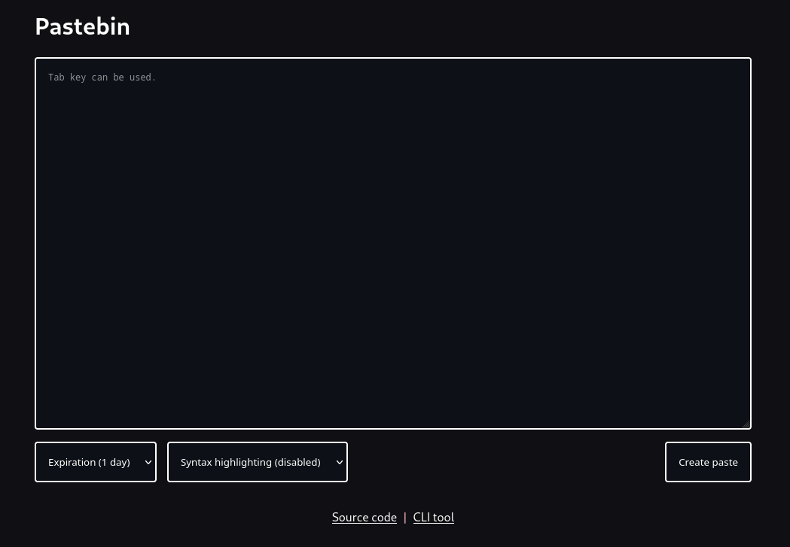

# Pastebin

## Features

- Syntax highlighting
- Expiring and permanent pastes
- Works with both SQLite and PostgreSQL
- Ability to post via the command line

## Deployment

You will need [Go](https://go.dev) to run the server. Install it via the website or through your package manager.

> git clone https://github.com/furo321/pastebin.git

Copy `.env.template` to `.env` and edit it accordingly. Once done, you can start the server with `go run .`

## Public instances

- [p.qwik.space](https://p.qwik.space)

If you wish to add your instance here, you can make a pull request.
